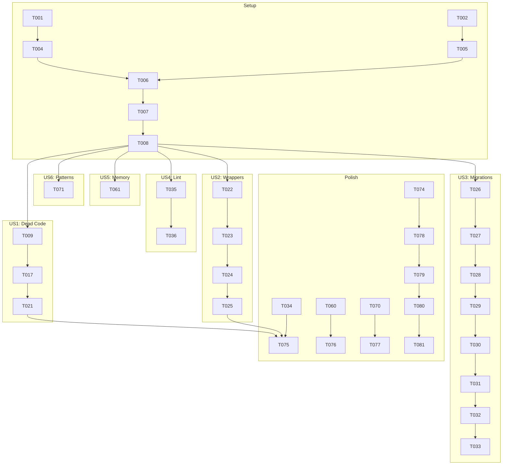

# Tasks: Codebase Cleanup & Migration Compaction

**Feature**: 010-codebase-cleanup
**Generated**: 2025-12-07
**Total Tasks**: 68

## User Story Mapping

| Story | Priority | Description | Tasks |
|-------|----------|-------------|-------|
| US1 | P1 | Clean Codebase Without Dead Code | T009-T020 (12 tasks) |
| US2 | P1 | Simplified Method Signatures | T021-T024 (4 tasks) |
| US3 | P2 | Compacted Database Migrations | T025-T033 (9 tasks) |
| US4 | P1 | Zero Lint Warnings | T034-T054 (21 tasks) |
| US5 | P1 | Memory-Efficient Code | T055-T064 (10 tasks) |
| US6 | P3 | Consistent Code Patterns | T065-T068 (4 tasks) |

---

## Phase 1: Setup

**Goal**: Establish baseline and validation infrastructure

- [ ] T001 Capture baseline lint counts with `golangci-lint run ./... 2>&1 | wc -l` in project root
- [ ] T002 [P] Capture baseline ESLint counts with `cd frontend && pnpm run lint 2>&1 | grep -c warning`
- [ ] T003 [P] Capture current database schema by running migrations and dumping schema
- [ ] T004 Run `goimports -w ./...` to auto-fix Go import issues in project root
- [ ] T005 [P] Run `cd frontend && pnpm exec eslint --fix .` to auto-fix ESLint issues
- [ ] T006 Run `task build` to verify baseline builds successfully
- [ ] T007 Run `task test` to verify all tests pass before changes
- [ ] T008 Run `task e2e:full` to verify E2E tests pass before changes

---

## Phase 2: Foundational (Blocking Prerequisites)

**Goal**: None - all user stories are independent for this cleanup feature

*No foundational tasks required - each user story can be executed independently.*

---

## Phase 3: User Story 1 - Clean Codebase Without Dead Code (P1)

**Goal**: Remove all unused functions, struct fields, and constants identified in research.md
**Independent Test**: `go build ./...` succeeds and `task test` passes after removals

### Dead Functions Removal

- [ ] T009 [US1] Remove unused `parseFormatParams()` function in `internal/http/handlers/relay_stream.go:203`
- [ ] T010 [P] [US1] Remove unused `streamRawHLSCollapsed()` function in `internal/http/handlers/relay_stream.go:734`
- [ ] T011 [P] [US1] Remove unused `shouldIncludeChannel()` function in `internal/pipeline/stages/filtering/stage.go:431`
- [ ] T012 [P] [US1] Remove unused `shouldIncludeProgram()` function in `internal/pipeline/stages/filtering/stage.go:464`
- [ ] T013 [P] [US1] Remove unused `updateOperation()` function in `internal/service/progress/service.go:263`
- [ ] T014 [P] [US1] Remove unused `updateOperationSilent()` function in `internal/service/progress/service.go:281`
- [ ] T015 [P] [US1] Remove unused `recalculateProgressImmediate()` function in `internal/service/progress/service.go:565`
- [ ] T016 [P] [US1] Remove duplicate `logoMetadataExtensionFromContentType()` function in `internal/storage/logo_metadata.go:363`

### Unused Struct Fields Removal

- [ ] T017 [US1] Remove unused `progressCh` and `errorCh` fields from Wrapper struct in `internal/ffmpeg/wrapper.go:32-33`
- [ ] T018 [P] [US1] Remove unused `cached` and `skipped` fields from logoCacheResult in `internal/pipeline/stages/logocaching/stage.go:53-54`
- [ ] T019 [P] [US1] Remove unused `duration` field from cachedSegment in `internal/relay/hls_passthrough.go:66`
- [ ] T020 [P] [US1] Remove unused `firstPTS`, `ptsSet`, `accumulatedDuration` fields from SegmentExtractor in `internal/relay/segment_extractor.go:65-69`

### Unused Constants Removal

- [ ] T021 [US1] Remove unused `httpPrefix` and `httpsPrefix` constants in `internal/ingestor/m3u_handler.go:24-25`

**Validation**: Run `task build && task test` after each removal group

---

## Phase 4: User Story 2 - Simplified Method Signatures (P1)

**Goal**: Remove duplicate/unnecessary wrapper methods
**Independent Test**: All call sites updated and tests pass

- [ ] T022 [US2] Remove duplicate `GetEnabledByPriority()` method from interface in `internal/repository/interfaces.go:356`
- [ ] T023 [US2] Remove `GetEnabledByPriority()` implementation in `internal/repository/relay_profile_mapping_repo.go:66-75`
- [ ] T024 [US2] Update 3 call sites in `internal/service/relay_profile_mapping_service.go` to use `GetEnabled()` instead (lines 97, 169, 327)
- [ ] T025 [US2] Run `task build && task test` to verify wrapper removal

**Validation**: `task test` passes with updated call sites

---

## Phase 5: User Story 3 - Compacted Database Migrations (P2)

**Goal**: Reduce 34 migrations to 2-3 while preserving schema and seed data
**Independent Test**: Fresh DB with new migrations has identical schema; E2E tests pass

### Preparation

- [ ] T026 [US3] Document current final schema by examining all model definitions in `internal/models/`
- [ ] T027 [US3] List all seed data from current migrations (filters, rules, profiles, mappings)

### Create Compacted Migrations

- [ ] T028 [US3] Create `migration001_schema()` function using GORM AutoMigrate for all 17 tables in `internal/database/migrations/registry.go`
- [ ] T029 [US3] Create `migration002_system_data()` function with all 32 seed records (2 filters, 1 rule, 6 profiles, 23 mappings) in `internal/database/migrations/registry.go`
- [ ] T030 [US3] Update `AllMigrations()` slice to return only the 2 new migrations in `internal/database/migrations/registry.go`
- [ ] T031 [US3] Remove all 34 old migration functions from `internal/database/migrations/registry.go`

### Validation

- [ ] T032 [US3] Delete test database and run `task test` to verify schema creation with new migrations
- [ ] T033 [US3] Run `task e2e:full` to verify E2E tests pass with compacted migrations
- [ ] T034 [US3] Verify migration count is 2 in the AllMigrations() slice

**Validation**: `task e2e:full` passes; fresh DB init < 1 second

---

## Phase 6: User Story 4 - Zero Lint Warnings (P1)

**Goal**: Resolve all ~100 golangci-lint and 422 ESLint warnings
**Independent Test**: `golangci-lint run ./...` and `pnpm run lint` return 0 warnings

### Go Lint Fixes - Command Layer

- [ ] T035 [US4] Create `mustBindFlag()` helper and fix viper.BindPFlag errors in `cmd/tvarr/cmd/root.go:52-53`
- [ ] T036 [US4] Use `mustBindFlag()` for all viper.BindPFlag calls in `cmd/tvarr/cmd/serve.go:71-80`

### Go Lint Fixes - E2E Runner

- [ ] T037 [P] [US4] Add error handling for json.Marshal, io.ReadAll, w.Write in `cmd/e2e-runner/main.go` (37 issues)

### Go Lint Fixes - FFmpeg

- [ ] T038 [P] [US4] Add explicit `_ =` for strconv parsing in `internal/ffmpeg/binary.go:236-237,490`
- [ ] T039 [P] [US4] Add explicit `_ =` for strconv parsing in `internal/ffmpeg/process_monitor.go:227-228,263-264,316`
- [ ] T040 [P] [US4] Add explicit `_ =` for progress parsing in `internal/ffmpeg/wrapper.go:756-791`

### Go Lint Fixes - HTTP Handlers

- [ ] T041 [P] [US4] Handle w.Write error in `internal/http/handlers/docs.go:122`
- [ ] T042 [P] [US4] Handle io.Copy error in `internal/http/handlers/logo.go:182`
- [ ] T043 [P] [US4] Handle w.Write errors in `internal/http/handlers/output.go:170,201`
- [ ] T044 [P] [US4] Handle w.Write error and assets.GetStaticFS error in `internal/http/handlers/static.go:55,94`

### Go Lint Fixes - Pipeline Stages

- [ ] T045 [P] [US4] Handle file.Stat error in `internal/pipeline/stages/generatem3u/stage.go:130`
- [ ] T046 [P] [US4] Handle file.Stat error in `internal/pipeline/stages/generatexmltv/stage.go:180`
- [ ] T047 [P] [US4] Use two-value type assertions in `internal/pipeline/stages/publish/stage.go:74,77,93,96`

### Go Lint Fixes - Relay System

- [ ] T048 [P] [US4] Add explicit `_ =` for fmt.Sscanf in `internal/relay/hls_passthrough.go:199,203`
- [ ] T049 [P] [US4] Add explicit `_ =` for strconv/regexp in `internal/relay/profile_tester.go:280-404`

### Go Lint Fixes - Service Layer

- [ ] T050 [P] [US4] Log errors for epgSourceRepo.Update calls in `internal/service/epg_service.go:223,284,397,457,466`
- [ ] T051 [P] [US4] Add explicit `_ =` for progress updates in `internal/service/progress/service.go:429-498`

### Go Lint Fixes - Scheduler

- [ ] T052 [P] [US4] Log errors for GetPending/GetRunning in `internal/scheduler/runner.go:344,346`

### ESLint Fixes - Frontend

- [ ] T053 [US4] Remove unused imports/variables and fix hooks in `frontend/src/app/channels/page.tsx`
- [ ] T054 [P] [US4] Remove unused imports/variables and fix hooks in `frontend/src/app/epg/page.tsx`
- [ ] T055 [P] [US4] Fix `any` types and unused imports in `frontend/src/components/CreateProxyModal.tsx`
- [ ] T056 [P] [US4] Fix hooks and unused imports in `frontend/src/components/NotificationBell.tsx`
- [ ] T057 [P] [US4] Fix hooks in `frontend/src/components/ConflictNotification.tsx`
- [ ] T058 [P] [US4] Fix hooks in `frontend/src/components/backend-unavailable.tsx`
- [ ] T059 [P] [US4] Convert `` to `next/image` in `frontend/src/app/channels/page.tsx`
- [ ] T060 [P] [US4] Convert `` to `next/image` in `frontend/src/app/epg/page.tsx`

**Validation**: `golangci-lint run ./...` and `pnpm run lint` return 0 warnings

---

## Phase 7: User Story 5 - Memory-Efficient Code (P1)

**Goal**: Add pre-allocation hints and cleanup patterns for zero-allocation hot paths
**Independent Test**: Memory profiling shows no regression; slice allocations have capacity

### Pipeline Stage Pre-allocation

- [ ] T061 [US5] Add capacity hint to `channelsNeedingNumbers` slice in `internal/pipeline/stages/numbering/stage.go:205`
- [ ] T062 [P] [US5] Add capacity hints to `channelFilters` and `programFilters` in `internal/pipeline/stages/filtering/stage.go:254,313`
- [ ] T063 [P] [US5] Add capacity hints to rules slices in `internal/pipeline/stages/datamapping/stage.go:61-62`
- [ ] T064 [P] [US5] Add capacity hint to `channelsWritten` map in `internal/pipeline/stages/generatexmltv/stage.go:83`

### Relay Component Pre-allocation

- [ ] T065 [P] [US5] Add capacity hint to `fragments` slice in `internal/relay/cmaf_muxer.go:98`
- [ ] T066 [P] [US5] Add capacity hints to segment maps in `internal/relay/dash_passthrough.go:85-88`
- [ ] T067 [P] [US5] Pre-allocate with previous size on map refresh in `internal/relay/dash_passthrough.go:223-224`
- [ ] T068 [P] [US5] Add capacity hint to `clients` map in `internal/relay/cyclic_buffer.go:76`
- [ ] T069 [P] [US5] Add capacity hint to `currentSegments` map in `internal/relay/hls_passthrough.go:283`

### Memory Cleanup Patterns

- [ ] T070 [US5] Add nil assignment for large slices after pipeline stage completion (review all stages in `internal/pipeline/stages/`)

**Validation**: `task test` passes; memory profile shows no regression

---

## Phase 8: User Story 6 - Consistent Code Patterns (P3)

**Goal**: Standardize patterns across similar components
**Independent Test**: Code review shows consistent patterns

- [ ] T071 [US6] Review and standardize error handling patterns across all repositories in `internal/repository/`
- [ ] T072 [US6] Review and standardize request validation patterns across all handlers in `internal/http/handlers/`
- [ ] T073 [US6] Use `clear()` for map clearing where Go 1.21+ is available throughout codebase
- [ ] T074 [US6] Use `errors.Is/As` instead of type assertions for error checking throughout codebase

**Validation**: Code review passes; `task test` passes

---

## Phase 9: Polish & Final Validation

**Goal**: Final verification and cleanup

- [ ] T075 Run final `golangci-lint run ./...` and verify 0 warnings
- [ ] T076 Run final `cd frontend && pnpm run lint` and verify 0 warnings
- [ ] T077 Run `task build` and verify successful build
- [ ] T078 Run `task test` and verify all tests pass
- [ ] T079 Run `task e2e:full` and verify all E2E tests pass
- [ ] T080 Verify fresh DB initialization completes in < 1 second
- [ ] T081 Count final lines of code and verify >= 5% reduction

---

## Dependencies



## Parallel Execution Opportunities

### Setup Phase (3 parallel tracks)
```
Track 1: T001 → T004 → T006
Track 2: T002 → T005
Track 3: T003
```

### Dead Code Phase (all parallel after T009)
```
T010, T011, T012, T013, T014, T015, T016 (all parallel)
T017, T018, T019, T020 (all parallel after functions removed)
```

### Lint Phase (highly parallel)
```
Go lint fixes: T037-T052 (all parallel)
ESLint fixes: T053-T060 (all parallel)
```

### Memory Phase (all parallel)
```
Pipeline: T061-T064 (all parallel)
Relay: T065-T069 (all parallel)
```

---

## Implementation Strategy

### MVP Scope (User Story 1 + 2)
Focus on dead code removal and wrapper elimination first - highest impact, lowest risk.

**MVP Tasks**: T001-T025 (25 tasks)
**MVP Validation**: `task build && task test` passes

### Incremental Delivery Order
1. **Sprint 1**: US1 (Dead Code) + US2 (Wrappers) - Foundation cleanup
2. **Sprint 2**: US4 (Lint) - Zero warnings achieved
3. **Sprint 3**: US3 (Migrations) - Schema consolidation
4. **Sprint 4**: US5 (Memory) + US6 (Patterns) - Optimization and polish

---

## Summary

| Metric | Value |
|--------|-------|
| Total Tasks | 81 |
| Setup Tasks | 8 |
| US1 Tasks | 13 |
| US2 Tasks | 4 |
| US3 Tasks | 9 |
| US4 Tasks | 26 |
| US5 Tasks | 10 |
| US6 Tasks | 4 |
| Polish Tasks | 7 |
| Parallel Opportunities | 45+ tasks can run in parallel |
| MVP Scope | T001-T025 (25 tasks) |
