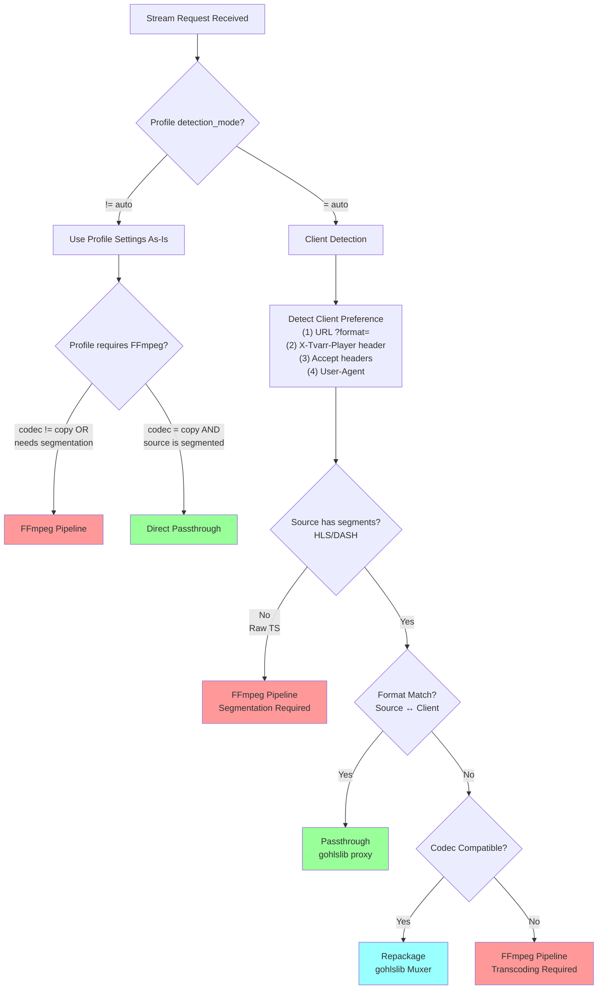

# Relay Routing Decision Flow

This document describes the routing decision logic for stream relay based on profile settings and client detection.

## Decision Flow Diagram

## Routing Paths Summary

| Path | Description | CPU Cost | When Used |
|------|-------------|----------|-----------|
| **Passthrough** | Direct proxy of source segments | Minimal | Format match, codec compatible |
| **Repackage** | Container change only (gohlslib Muxer) | Low | Different container, same codecs |
| **FFmpeg Pipeline** | Full transcoding or segmentation | High | Codec mismatch, raw TS source, or explicit profile |

## Profile Mode Behavior

### When `detection_mode != "auto"` (Explicit Profile)

The profile's settings are used exactly as configured:

- If `video_codec = copy` and `audio_codec = copy` and source is segmented → Direct passthrough
- If `video_codec = copy` and `audio_codec = copy` but source is raw TS → FFmpeg for segmentation only
- If any codec is not "copy" → FFmpeg for transcoding

**Client detection is bypassed entirely.** The user has explicitly configured output settings.

### When `detection_mode = "auto"` (Smart Routing)

Client detection determines the optimal delivery path:

1. **URL parameter** (`?format=mpegts` or `?format=fmp4`) - Highest priority
2. **X-Tvarr-Player header** - Player self-identification (hls.js, mpegts.js)
3. **Accept headers** - MIME type preferences
4. **User-Agent** - Fallback player detection

Then the system evaluates:
- Does the source have segments (HLS/DASH) or is it raw TS?
- Does the detected client format match the source format?
- Are the codecs compatible?

## Format Routing Matrix (Auto Mode Only)

### When Codecs Are Compatible (H.264/AAC)

| Source Format | Client Wants | Routing Path | Method |
|---------------|--------------|--------------|--------|
| HLS (fMP4) | HLS (fMP4) | Passthrough | gohlslib Client → direct proxy |
| HLS (fMP4) | HLS (TS) | Repackage | gohlslib Client → gohlslib Muxer (TS) |
| HLS (fMP4) | MPEG-TS raw | Repackage | gohlslib Client → TS muxer |
| HLS (TS) | HLS (fMP4) | Repackage | gohlslib Client → gohlslib Muxer (fMP4) |
| HLS (TS) | HLS (TS) | Passthrough | gohlslib Client → direct proxy |
| HLS (TS) | MPEG-TS raw | Passthrough | Direct segment concatenation |
| DASH (fMP4) | HLS (fMP4) | Repackage | DASH parser → gohlslib Muxer |
| DASH (fMP4) | HLS (TS) | Repackage | DASH parser → gohlslib Muxer (TS) |
| Raw TS | HLS (any) | FFmpeg | Segmentation required |
| Raw TS | MPEG-TS raw | Passthrough | Direct proxy |

### When Codec Mismatch Detected

| Scenario | Routing Path | Reason |
|----------|--------------|--------|
| Source: VP9, Client: H.264 only | FFmpeg | Transcoding required |
| Source: HEVC, Client: H.264 only | FFmpeg | Transcoding required |
| Source: Opus, Client: AAC only | FFmpeg | Audio transcoding required |

## Key Design Decisions

1. **Profile settings always win when not "auto"**: User intent is respected
2. **Auto mode optimizes for efficiency**: Avoid FFmpeg when possible
3. **URL parameters override headers**: Explicit user request takes precedence
4. **Raw TS always needs FFmpeg**: Cannot repackage without segmentation
5. **Codec mismatch always needs FFmpeg**: Cannot change codecs without transcoding
