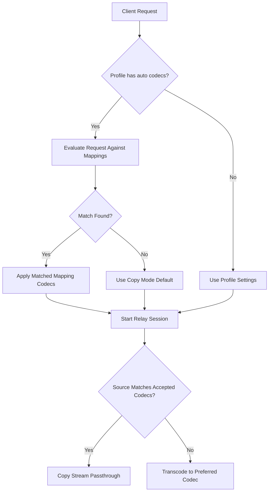
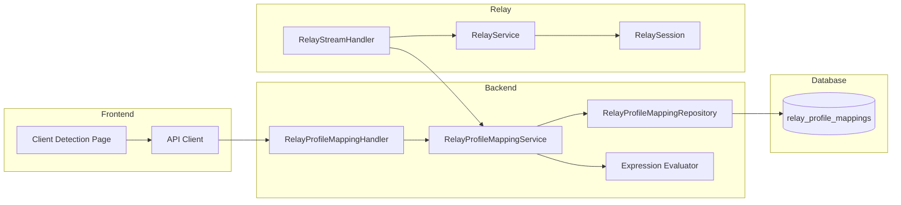
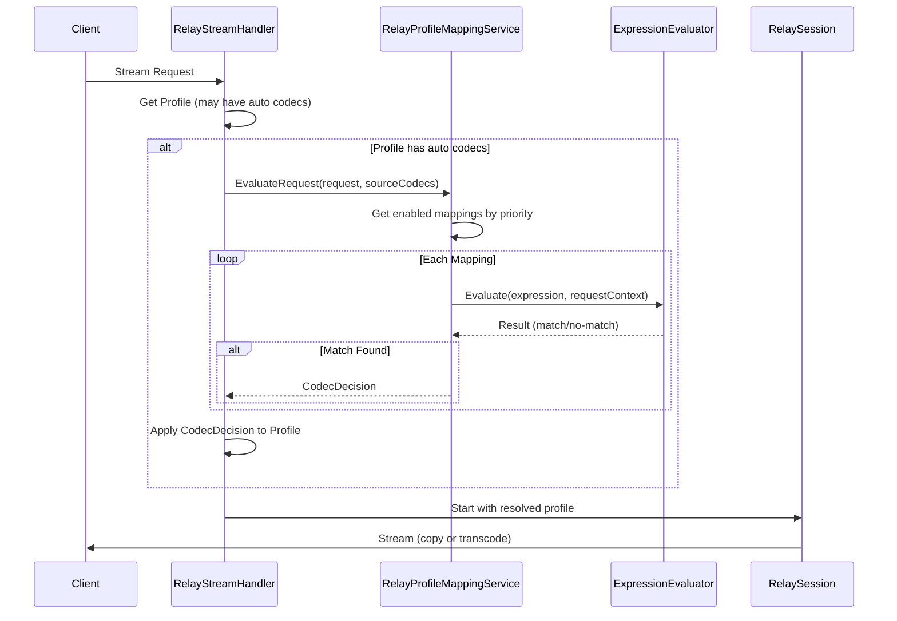
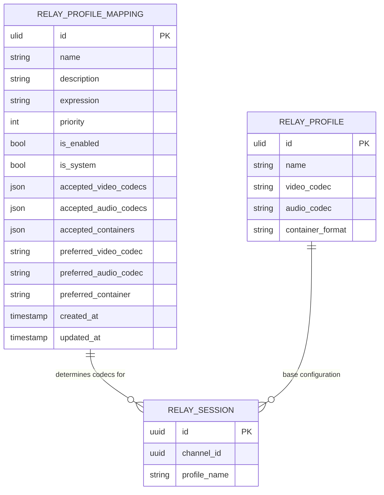

# Client Detection (Relay Profile Mappings)

This document describes the client detection system that automatically selects optimal codec settings based on client capabilities.

## Overview

The client detection system allows tvarr to automatically choose appropriate video and audio codecs based on the requesting client's capabilities. This is particularly useful when streaming to diverse devices like browsers, native media players, streaming devices, and IPTV apps.

## How It Works

## Architecture

## Expression Evaluation Flow

## Data Model

## Expression Fields

The following fields are available for client detection expressions:

| Field | Description | Example |
|-------|-------------|---------|
| `user_agent` | HTTP User-Agent header | `user_agent contains "Chrome"` |
| `client_ip` | Client IP address | `client_ip startsWith "192.168."` |
| `request_path` | Request URL path | `request_path contains "/hls/"` |
| `request_url` | Full request URL | `request_url contains "format=ts"` |
| `query_params` | Raw query string | `query_params contains "quality=hd"` |
| `x_forwarded_for` | X-Forwarded-For header | `x_forwarded_for != ""` |
| `x_real_ip` | X-Real-IP header | `x_real_ip startsWith "10."` |
| `accept` | Accept header | `accept contains "video/mp4"` |
| `accept_language` | Accept-Language header | `accept_language contains "en"` |
| `host` | Host header | `host = "tv.example.com"` |
| `referer` | Referer header | `referer contains "example.com"` |

## Default Mappings

The system includes default mappings for common clients:

### Browsers
- Chrome, Firefox, Safari, Edge
- Typically support: H.264 + AAC in HLS/fMP4

### Native Players
- VLC, mpv, Kodi
- Typically support: All codecs via copy mode

### Streaming Devices
- Roku, Apple TV, Fire TV, Chromecast
- Typically support: H.264/HEVC + AAC

### Mobile
- iOS Safari, Android Chrome
- Typically support: H.264 + AAC

### IPTV Apps
- Perfect Player, OTT Navigator, TiviMate
- Typically support: H.264/HEVC + AAC

## Priority System

Mappings are evaluated in priority order (lowest number = highest priority):
1. First matching rule wins
2. System mappings cannot be deleted
3. Custom mappings can be reordered via UI

## API Endpoints

| Method | Endpoint | Description |
|--------|----------|-------------|
| GET | `/api/v1/relay-profile-mappings` | List all mappings |
| GET | `/api/v1/relay-profile-mappings/{id}` | Get mapping by ID |
| POST | `/api/v1/relay-profile-mappings` | Create mapping |
| PUT | `/api/v1/relay-profile-mappings/{id}` | Update mapping |
| DELETE | `/api/v1/relay-profile-mappings/{id}` | Delete mapping |
| POST | `/api/v1/relay-profile-mappings/reorder` | Reorder priorities |
| POST | `/api/v1/relay-profile-mappings/test` | Test expression |
| GET | `/api/v1/relay-profile-mappings/stats` | Get statistics |

## Configuration

To use client detection:

1. Create a Relay Profile with `video_codec: auto` and/or `audio_codec: auto`
2. Configure Client Detection mappings (or use defaults)
3. Assign the auto profile to a Stream Proxy
4. When clients connect, the system automatically selects appropriate codecs
